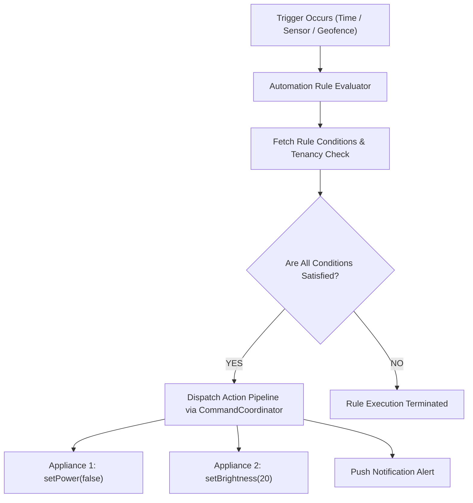

# NoskyTech Ecosystem — Scenes & Automations Architecture (Phase 0 — Revision 4.2 Implementation-Readiness Patch)

## 1. Overview & Rule Engine Architecture

The Automation Subsystem executes deterministic rules (`IF <triggers> AND <conditions> THEN <actions>`) and scene presets across both local edge hardware and cloud relays.



---

## 2. Formal Typed Automation Rule Schema & Local Engine

Smart Watt hardware incorporates an onboard Real-Time Clock (RTC) and normalized sensor endpoints to support fully autonomous local execution.

### 2.1 Formal JSON Rule Schema Definition

```json
{
  "rule_id": "rule-550e8400-e29b-41d4-a716-446655440000",
  "enabled": true,
  "name": "Evening Porch Light",
  "trigger": {
    "type": "TIME_TRIGGER",
    "cron": "0 19 * * *",
    "sensor_instance_id": null
  },
  "conditions": [
    {"field": "presence_state", "operator": "EQUALS", "value": "ABSENT"}
  ],
  "actions": [
    {"type": "SET_OUTPUT", "endpoint_instance_id": "relay_1", "capability": "power", "desired_value": true}
  ],
  "schedule": {
    "timezone": "Africa/Lagos",
    "dst_active": false
  },
  "execution_policy": {
    "missed_schedule_policy": "IGNORE",
    "retry_count": 3
  }
}
```

### 2.2 Trigger & Action Types

* **Supported Trigger Types**:
  1. `TIME_TRIGGER`: Schedules evaluated via local hardware RTC (Cron string or interval seconds).
  2. `SENSOR_TRIGGER`: Presence or electrical threshold events (`presence_state == PRESENT`, `voltage > 250V`).
  3. `STATE_TRIGGER`: Endpoint state change triggers (`relay_1 == OFF`).
* **Supported Action Types**:
  1. `SET_OUTPUT`: Actuates relay or output endpoints (`desired_value = true/false`).

---

## 3. Local Runtime & Proximity Sensor Semantics

* **Cypher vs MCU Responsibility**: Cypher translates user natural language intent into the formal JSON rule schema above. Cypher is **NOT the runtime scheduler**. The compiled rule is committed to MCU wear-leveled NVS and executed locally by the MCU.
* **Presence Abstraction**: Proximity rules evaluate normalized fields (`presence_state`, `presence_confidence`, `last_detected_at`) rather than hardcoding specific physical sensor hardware logic.
* **Missed Schedule Policy**: Upon reboot post-outage, rules configured with `missed_schedule_policy = "CATCH_UP"` execute missed actions if outage duration was $< 1\text{ hour}$; rules with `"IGNORE"` skip to the next trigger tick.
