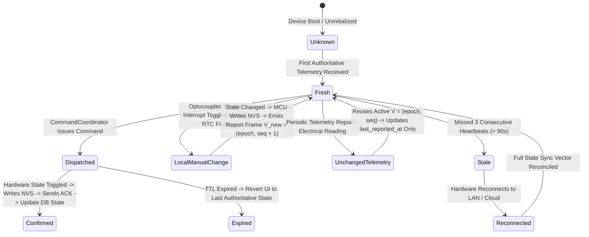

# NoskyTech Ecosystem — State Taxonomy & Offline Architecture (Phase 0 — Revision 4.2 Implementation-Readiness Patch)

## 1. Explicit State Taxonomy & Separation

To eliminate architectural confusion between state data, command lifecycles, and data quality status, Revision 4.2 establishes three separate taxonomy groups:

### 1.1 State Data Representations
- **Desired State**: Target value requested by user/automation (`power = false`).
- **Reported State**: Endpoint value reported by MCU telemetry or ACK payload.
- **Authoritative State**: Confirmed physical value matching active $V = (\text{epoch}, \text{sequence})$.
- **Cached State**: Local SQLite persistent store copy on mobile clients.

### 1.2 Sequence Increment Rule (State Transitions vs Observations)
- **State Transition Version**: `sequence` is incremented **only upon physical or software state changes** (`relay ON → OFF`).
- **Observation / Report Metadata**: Telemetry reports (e.g., electrical voltage/current measurements) or periodic heartbeats confirming unchanged states **reuse the current Device Logical Version `(epoch, sequence)`** and record observation timestamps (`last_reported_at`) separately.

### 1.3 Command Lifecycle Statuses
- **Created**: Command generated by `CommandCoordinator` with `command_id` and `correlation_id`.
- **Dispatched**: Packet handed to `TransportManager` for network transmission.
- **Accepted**: Hardware acknowledged receipt of command frame.
- **Executed**: MCU executed output relay actuation.
- **Confirmed**: `CommandCoordinator` received ACK frame and updated authoritative DB state.
- **Expired**: Command exceeded `expires_at` prior to execution.
- **Rejected**: Authorization check failed or sequence check failed (`DROPPED_STALE`).
- **Failed**: Physical hardware fault prevented actuation.

### 1.4 Data Quality / Freshness Statuses
- **Fresh**: Device has sent heartbeat or state report within last 90 seconds.
- **Stale**: Device unreachable for > 90 seconds; UI displays cached value with stale indicator.
- **Unknown**: Uninitialized endpoint state.

---

## 2. RTC & Sensor-Driven Offline Automation Invariant

When cloud or Internet connectivity is severed, Smart Watt devices continue operating installed schedules and sensor automations locally:

```text
               [ Cloud / Internet Offline ]
                            │
                            ▼
     [ Hardware RTC Interrupt / Sensor Event Trigger ]
                            │
                            ▼
     [ Local Automation Rule Evaluator (MCU NVS) ]
                            │
                            ▼
  [ Output Actuation -> NVS State Commit -> Emits Local LAN Report ]
```

- **Local Persistence**: Automation rules compiled by Cypher are stored in wear-leveled NVS.
- **RTC Clock Independence**: Onboard hardware RTC maintains local schedule execution without cloud time servers.
- **LAN Telemetry Sync**: Local state transitions increment `(epoch, sequence)` and broadcast local NDP v1 reports to active LAN clients over Noise sockets.

---

## 3. Durable Persistence Invariant & State Transition Matrix

### Durable State Invariant
*Every successfully reported endpoint state must possess a Device Logical Version $(epoch, sequence)$ strictly greater than the last durable version known for that endpoint.*


