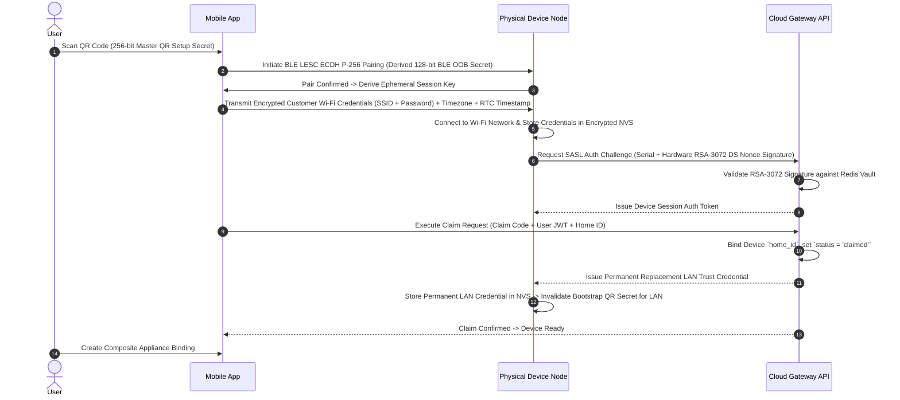

# NoskyTech Ecosystem — Device Identity & Provisioning Specification (Phase 0 — Revision 4.2 Implementation-Readiness Patch)

## 1. Lifecycle Overview

Device provisioning transitions a raw physical device manufactured in a factory into an authenticated, user-claimed home node.

```text
+-------------------+      +--------------------+      +-------------------+
| 1. FACTORY PHASE  | ---> | 2. ONBOARDING PHASE| ---> | 3. CLAIMING PHASE |
| Burn ID & Keys to |      | Wi-Fi Setup via    |      | Bind to Home ID & |
| Flash Encryption  |      | BLE LESC ECDH      |      | Composite Mapping |
+-------------------+      +--------------------+      +-------------------+
```

---

## 2. Factory Identity & Zero Hardcoded Credentials

During manufacturing, every device receives:
1. `serial_number`: Formatted string (`NOSKY-SW01-YYYY-XXXXXX`).
2. `mac_address_wifi` & `mac_address_ble`: MCU hardware MAC addresses.
3. `rsa_public_key` & `rsa_private_key`: Hardware signing keypair configured within the ESP32-S3 Digital Signature Peripheral backed by eFuse HMAC keys.
4. `setup_code`: Random 256-bit Physical QR Setup Secret (printed on physical chassis QR code sticker).

### Zero Hardcoded Credentials Invariant
The ESP32 firmware SHALL contain **zero hardcoded customer Wi-Fi SSIDs or passwords**. All network credentials are provided by the user during the authenticated onboarding flow.

---

## 3. End-to-End Onboarding & Claiming Sequence



---

## 4. Customer Wi-Fi Reconfiguration & Security Rotation Policy

### 4.1 Authenticated Wi-Fi Credential Reconfiguration
Users can update their router's Wi-Fi SSID or password through an authenticated reconfiguration flow:
```text
Authenticated Mobile App (Home Member Role)
       ↓
Encrypted Reconfiguration Frame (LAN Noise Transport or Cloud MQTTS)
       ↓
Device NVS Update (Atomically overwrites Wi-Fi SSID/Password slots)
       ↓
Re-associate with updated Wi-Fi Access Point
```
*Note: Wi-Fi credential reconfiguration updates network transport access without invalidating `lan_trust_credential` or home claiming bindings.*

### 4.2 Wi-Fi Credential Security Rotation Policy
- **No Arbitrary Disconnection**: The device MUST NOT arbitrarily invalidate or disconnect a customer's router Wi-Fi password after 30 days.
- **Security Reminder Policy**: Optional 30-day credential rotation prompts represent a user-facing security best-practice reminder in the mobile application, NOT an automated network eviction mechanism.

---

## 5. Maintenance, Recovery & Reset Workflows

- **Ownership Transfer**: Step-wise workflow. Previous Owner initiates transfer in app; Cloud sets device status to `unclaimed`. New Owner scans QR code to claim.
- **Credential Revocation**: Owner taps "Revoke Device". Cloud invalidates active tokens; EMQX terminates MQTT TCP session immediately.
- **Hard Factory Reset**: Physical button held for 10s. MCU erases NVS Wi-Fi credentials, wipes setup bonds, increments `device_identity_generation`, resets `boot_epoch` to 1, re-enables factory BLE setup mode.
