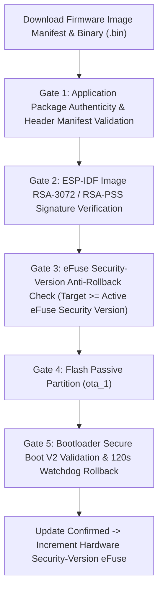

# NoskyTech Ecosystem — Security Architecture Specification (Phase 0 — Revision 4.2 Implementation-Readiness Patch)

## 1. Overview & Threat Boundaries

Revision 4.2 aligns security contracts directly with native ESP32-S3 hardware peripherals and ESP-IDF security features.

```text
+-----------------------------------------------------------------------------------+
| TRUST BOUNDARY 1: PUBLIC CLIENT LAYER                                             |
| Mobile App (React Native - Provisional) / Web Dashboard                           |
+-----------------------------------------------------------------------------------+
                                         ||  Supabase Auth JWT / TLS 1.3
                                         \/
+-----------------------------------------------------------------------------------+
| TRUST BOUNDARY 2: CLOUD API & SERVICE LAYER                                       |
| Command Coordinator / RBAC Authorization Engine / Cypher AI Tool Service           |
+-----------------------------------------------------------------------------------+
                                         ||  Internal Service Role (Service Key)
                                         \/
+-----------------------------------------------------------------------------------+
| TRUST BOUNDARY 3: CREDENTIAL VAULT                                                |
| PostgreSQL `device_credentials` (NO RLS - Internal Service Access Only)           |
+-----------------------------------------------------------------------------------+
                                         ||  MQTT 5.0 Enhanced SASL Auth / Hardware RSA-3072 DS
                                         \/
+-----------------------------------------------------------------------------------+
| TRUST BOUNDARY 4: PHYSICAL HARDWARE NODE                                          |
| ESP32-S3 Hardware (Secure Boot V2 + Flash Encryption + Digital Signature)         |
+-----------------------------------------------------------------------------------+
```

---

## 2. Hardware Device Authentication Contract

Device authentication SHALL use hardware-backed asymmetric signing supported by the target ESP32 variant's Digital Signature peripheral. For ESP32-S3 targets, RSA-3072 signatures SHALL be evaluated and implemented using the ESP-IDF Digital Signature API and the selected eFuse/HMAC key-protection configuration during the Phase 1B hardware spike.

- **Auth Protocol**: Native MQTT 5.0 SASL Enhanced Authentication.
- **Verification Engine**: EMQX broker nodes validate RSA-3072 signatures locally in memory against Redis public key caches (**zero PostgreSQL queries on connection path**).
- **Topic Authorization (ACL)**: `noskytech/v1/devices/{device_id}/*`. EMQX ACL rules enforce that `device_id` in token matches the topic path.

---

## 3. Bluetooth LE (BLE) Security Profile & Credential Transition

- **Pairing Protocol**: BLE LE Secure Connections (LESC) ECDH P-256 with OOB 128-bit setup secret.
- **Credential Lifecycle**: Physical QR code setup secret is a **bootstrap credential**. Upon claiming, a permanent replacement LAN trust credential is cryptographically derived and saved to NVS.
- **Dual-Layer Security Rationale**: BLE link-layer encryption protects the physical wireless medium; application-layer AEAD protects NDP frames independently of underlying transport.

---

## 4. Native ESP-IDF Secure Boot V2 & OTA Pipeline

Firmware update deployment aligns directly with native ESP32-S3 Secure Boot V2 and hardware anti-rollback eFuse features:


